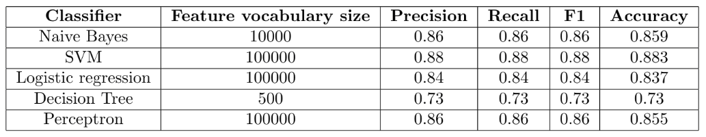

# Sentiment Analysis

We use IMDB movie review dataset provided by Stanford: http://ai.stanford.edu/~amaas/data/sentiment and compare performance of various common binary classifiers for sentiment analysis.  
The binary classifiers and their performance is shown in table below:

## Results.
* Raw results are in [train\_result.txt](train_result.txt)
* [Presentation](Presentation.pdf)
* [Report](Report.pdf)

## Running code.
`python train_main.py`  
We need `scikit-learn` and `python2` to run code.

